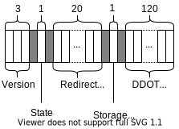
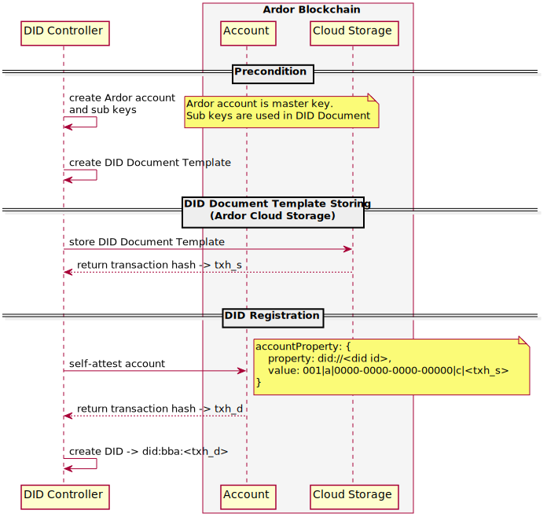
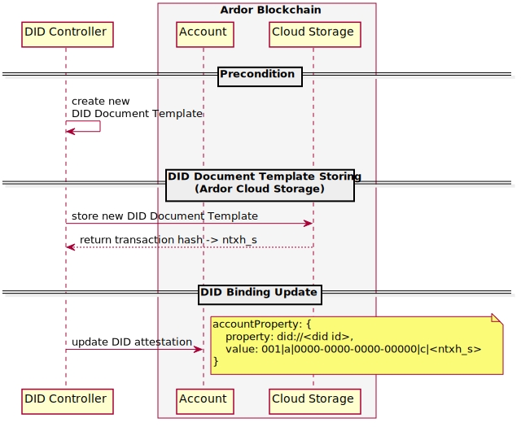
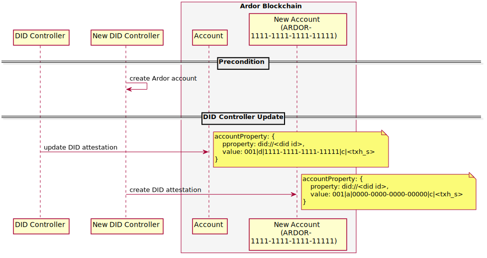
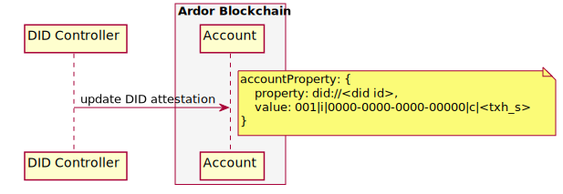
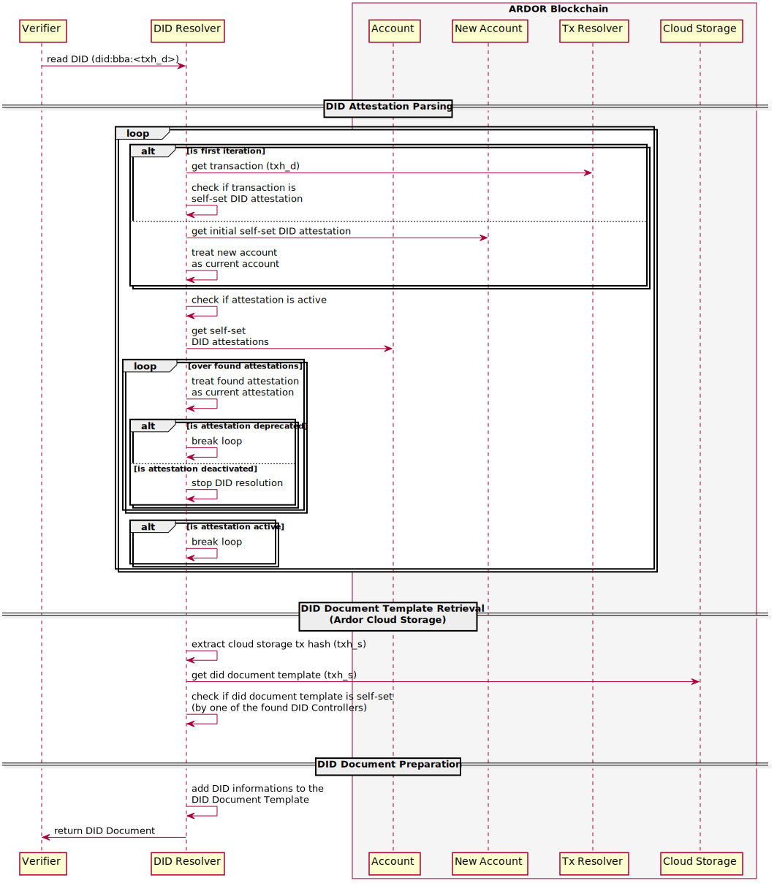

# BBA DID Method Specification

This document specifies the `bba` DID method as part of the [Blobaa](https://github.com/blobaa) project. It conforms to the [DID Core Specification](https://www.w3.org/TR/2020/WD-did-core-20200731/) (W3C Working Draft 31 July 2020) specified by the [W3C DID Working Group](https://www.w3.org/2019/did-wg/).
 <!-- and has been added to W3Cs [DID method registry](https://w3c.github.io/did-spec-registries/#did-methods). -->

A reference implementation for handling the `bba` CRUD operations is available [here](https://github.com/blobaa/bba-did-method-handler-ts).


## Version

Current version: 1.0.0


## Status

This document is under development and may be updated at any time.


## Table of Contents

<details><summary><i>click to expand</i></summary>
<p><br/>

- [BBA DID Method Specification](#bba-did-method-specification)
    - [Version](#version)
    - [Status](#status)
    - [Table of Contents](#table-of-contents)
    - [Introduction](#introduction)
    - [DID Attestation Data Fields](#did-attestation-data-fields)
        - [DID Id](#did-id)
        - [Data Field Concatenation](#data-field-concatenation)
        - [Version](#version-1)
        - [State](#state)
        - [Redirect Account](#redirect-account)
        - [Storage Type](#storage-type)
            - [Ardor Cloud Storage](#ardor-cloud-storage)
        - [DID Document Template Reference](#did-document-template-reference)
        - [Misc](#misc)
    - [Method-specific DID syntax](#method-specific-did-syntax)
    - [CRUD Operations](#crud-operations)
        - [Create](#create)
            - [DID Document Template](#did-document-template)
            - [DID](#did)
        - [Update](#update)
            - [DID Document Template Update](#did-document-template-update)
            - [DID Controller Update](#did-controller-update)
        - [Deactivate](#deactivate)
        - [Read (Resolve)](#read-resolve)
    - [Security Requirements](#security-requirements)
        - [Key Management](#key-management)
        - [Authorization](#authorization)
        - [Usage](#usage)
        - [DID ID Collusion](#did-id-collusion)
        - [Resolution Speed](#resolution-speed)
    - [Privacy Requirements](#privacy-requirements)

</p>
</details>


## Introduction

The `bba` DID method aims to enable the [Ardor](https://ardorplatform.org) blockchain to act as a [DPKI](https://www.weboftrust.info/downloads/dpki.pdf) within the [SSI](https://www.manning.com/books/self-sovereign-identity) ecosystem. It runs on the independent [IGNIS](https://www.jelurida.com/ignis) child chain and utilizes Ardors [Account Properties](https://ardordocs.jelurida.com/Account_Properties) feature to manage DIDs and corresponding DID controllers. A DID controller is always represented in form of an Ardor account and is by default separated from the public keys (if present) embedded in a resolved DID Document. Think of a master key controlling the DID operations create, update and deactivate. A DID controller always corresponds to exactly one Ardor account, whereas one Ardor account can control multiple DIDs.

DID and DID Document handling is decoupled so that multiple DID Document storages can be defined and integrated to store DID Document Templates (DID Documents without a DID reference). In its current state, the `bba` DID method defines only one storage type (Ardor Cloud Storage).

In the following, `bba` DID method compliant account properties are called DID attestations. An account property is `bba` DID method compliant if it aligns to the data model described in the DID Attestation Data Fields section and is self-set. A self-set account property is a property where sender and receiver accounts are identical.


## DID Attestation Data Fields

Since the `bba` method utilizes the account property feature, most of its data fields are embedded in the *value* key/value pair of a property. In Ardor, an account property is represented as a JSON object with at least a *property* and a *value* key/value pair. An example attestation can be found [here](https://testardor.jelurida.com/index.html?account=ARDOR-S27P-EHWT-8D2L-937R7&chain=IGNIS&modal=transaction_info_modal&fullhash=0239684aef4c0d597b4ca5588f69327bed1fedfd576de35e5099c32807bb520e).


### DID Id

The only data field not embedded in the *value* key/value pair that is used to determine a specific DID is the **DID Id**. It represents the value of the *property* key/value pair and is used to provide the ability to control multiple DIDs with one account. To indicate that a property is a DID attestation, the property value starts with the prefix *did://*, followed by a unique, case-sensitive, 20-character long  alphanumeric DID Id. For example: `did://EZVDomDNygTr79QXKnzE`


### Data Field Concatenation

All other data fields are embedded in the 160 characters long *value* key/value pair. They consist of one or more characters concatenated into a defined order and separated by a pipe delimiter (\|), as shown below.



*character arrangement of DID attestation data fields*


### Version

The **Version** field points to the `bba` method version. It is a three-digit number starting with 001 and needs to be incremented whenever a protocol update occurs. The current version number is 001.


### State

The **State** data field indicates the current state of an attestation. There are three state types:

An **active** state indicates that a DID is active and can be resolved.

An **inactive** state states that a DID was active in the past and is now inactive. It can no longer be resolved and cannot be reactivated.

A **deprecated** state states that the DID controller is deprecated and the DID is now controlled by another controller. The new DID controller account is referenced in the redirect account data field.


The following table shows the state characters used to represent the attestation state:

| State | State Character | Brief                                                               |
|------------|:--------------------:|---------------------------------------------------------------------|
| active     |           a          | DID is active and resolvable                           |
| inactive   |           i          | DID is inactive and cannot be resolved and reactivated                       |
| deprecated |           d          | DID controller is deprecated and new controller is referenced via the redirect account field |


### Redirect Account

The **Redirect Account** data field is only used in case of a deprecated state. It refers to the controller account that has taken control of the DID. To save character space, this data field does not contain the complete [Reed-Solomon](https://ardordocs.jelurida.com/RS_Address_Format) account representation. Only the significant 20 characters without the prefix *ARDOR-* are present. To use the redirecting account, one needs to reconstruct the Reed Solomon representation later on. If the data field is not used, it has the dummy value *0000-0000-0000-0000000*.


### Storage Type

The storage type character indicates the storage mechanism used to store and retrieve a DID Document Template (DDOT). It must specify a mechanism to cryptographically prove that a DDOT has not been tampered with between storage and retrieval, define methods for storing and retrieving a DDOT, and define a reference that fits in the DDOT reference field.


#### Ardor Cloud Storage

At the current state, only the Ardor Cloud Storage mechanism is defined. It uses Ardors [Data Cloud](https://ardordocs.jelurida.com/Data_Cloud) feature to store a stringified DDOT JSON in plain text within a transaction. To be recognized as a `bba` method compliant cloud data, the cloud data name field must be set to `bba-did-document-template`. The transaction full hash value is then used as the DDOT reference and can later be used to retrieve the data cloud transaction and thus the DDOT object.


The following table shows the storage type characters that are used to represent the storage types:

| Storage Type | Storage Type Character | Brief                                                               |
|------------|:--------------------:|---------------------------------------------------------------------|
| Ardor Cloud Storage     |           c          | DDOT is stored in Ardors Data Cloud                          |


### DID Document Template Reference 

The DDOT reference field contains the DDOT reference used to retrieve the DID-related DDOT. It binds the DDOT cryptographically to the DID. It can consist of any character string not longer than 120 characters. The interpretation of these characters is defined by the storage mechanism.


### Misc

It should be mentioned that not all 160 characters are being used. Only 149 characters are occupied: 3 (version) + 1 (state) + 20 (redirect account) + 1 (storage type) + 120 (payload) + 4 (delimiter). The missing 11 characters are reserved for future method extensions.


## Method-specific DID syntax

The following ABNF defines the bba-specific DID scheme:

```ABNF
bba-did = "did:bba:" bba-identifier
bba-identifier = [ ardor-network ":" ] ardor-tx-hash
ardor-network = "m" / "t"
ardor-tx-hash = 64HEXDIG
```

`bba` DIDs can refer either to Ardor's test network or to the main network. If no network is specified, the main network is assumed.

A `bba` DID contains the full hash of the first attestation transaction as a starting point and identifier. Due to the transaction hash as a unique identifier, it can be assumed that `bba` DIDs are globally unique.

Example DIDs:

**mainnet**

`did:bba:fd8127c808552656bf3986a42884bd9ffc459fb5d71aec48e7535336a6191bf6`
</br>
or
</br>
`did:bba:m:fd8127c808552656bf3986a42884bd9ffc459fb5d71aec48e7535336a6191bf6`

**testnet**

`did:bba:t:11764950b0e8e69694831a9860256178a957c1064ca7c5dd8c44a20d384fe00c`


## CRUD Operations

The `bba` method  defines five operations to create, read, update (DDOT and DID controller) and deactivate a DID.


### Create

To create a DID, a DID Document Template is required. It contains the information of the DID Document associated to the DID.


#### DID Document Template

The difference between a resolved DID Document and the DID Document Template stored with a storage mechanism is the associated DID. The DDOT does not contain any DID informations about the associated DID. As an example, a valid DID Document Template is shown below:
````
{
    "@context": [
        "https://www.w3.org/ns/did/v1",
        "https://w3id.org/security/v1"
    ],
    "id": "",
    "authentication": [
        {
            "id": "#z6MkjAySi1Ajf3cwZntbsmo53dmC8GX1Dm6PLmmBaC6SRuiy",
            "type": "Ed25519VerificationKey2018",
            "publicKeyBase58": "5iiQ7kvJKW8UTJ3uCCqECYDCJhF9osr2ekrFjv8RWgwb"
        }
    ]
}
````

The read operation is later responsible for linking this template to the corresponding DID by inserting the missing DID information into the resolved DID Document. The DID Document created based on the DDOT above and the `bba:t:11764950b0e8e69694831a9860256178a957c1064ca7c5dd8c44a20d384fe00c` DID is shown below.
````
{
    "@context": [
        "https://www.w3.org/ns/did/v1",
        "https://w3id.org/security/v1"
    ],
    "id": "did:bba:t:11764950b0e8e69694831a9860256178a957c1064ca7c5dd8c44a20d384fe00c",
    "authentication": [
        {
            "id": "did:bba:t:11764950b0e8e69694831a9860256178a957c1064ca7c5dd8c44a20d384fe00c#z6MkjAySi1Ajf3cwZntbsmo53dmC8GX1Dm6PLmmBaC6SRuiy",
            "type": "Ed25519VerificationKey2018",
            "publicKeyBase58": "5iiQ7kvJKW8UTJ3uCCqECYDCJhF9osr2ekrFjv8RWgwb"
        }
    ]
}
````

The mechanism to create a valid DID Document Template is outside the scope of this specification. A library assisting in the creation process is provided in form of the [did-document-ts](https://github.com/blobaa/did-document-ts) project.

Separating the DDOT creation process from the DID creation process has the benefit of being independent to the evolution of the DID data model and lets the `bba` method being compatible with future data models and custom contexts. A DDOT creator must ensure that the related DID Document conforms to the DID specification.


#### DID

Creating and registering a `bba` DID involves multiple steps, as shown in the figure below:



*DID creation workflow*

As a precondition it is assumed that the DID controller has an Ardor account created and access to the DDOT one wants to link to the DID.

The first step in the creation process is to store the DDOT with a supported storage mechanism. The Ardor Cloud Storage mechanism is used here. To store the DDOT, the DID controller must create a data cloud transaction, as explained in the Ardor Cloud Storage section, and memories the transaction full hash `txh_s` to associate the DDOT with the DID. A sample transaction can be found [here](https://testardor.jelurida.com/index.html?account=ARDOR-S27P-EHWT-8D2L-937R7&chain=IGNIS&modal=transaction_info_modal&fullhash=d50168874504b75afa2880f62ef20c9a2b9b9d8e1dc846c6802fb857462a8dd5).

The next step is to register the DID. To do so, the DID controller creates a DID attestation for the Ardor account the controller controls with a newly generated DID Id and the storage transaction hash `txh_s` as a DDOT reference. A sample transaction can be found [here](https://testardor.jelurida.com/index.html?account=ARDOR-S27P-EHWT-8D2L-937R7&chain=IGNIS&modal=transaction_info_modal&fullhash=0239684aef4c0d597b4ca5588f69327bed1fedfd576de35e5099c32807bb520e).

The last step is to create the DID string. The DID string can now be created by concatenating the DID prefix `did:bba:` with the network character on which the DID was registered and the full hash `txh_d` of the authentication transaction in the following way: `did:baa:<m or empty (without leading ':') for mainnet / t for testnet>:txh_d` An example DID is `did:baa:t:0239684aef4c0d597b4ca5588f69327bed1fedfd576de35e5099c32807bb520e`.


### Update

Two update procedures are defined. One for updating a DID Document Template and one for updating a DID controller.


#### DID Document Template Update

To change a DID document, the corresponding DDOT must be updated. This is done using almost the same workflow as described in the Create section and illustrated in the figure below. Again, it is assumed that a DID controller has been created/is in possession of the new DDOT that should replace the current DDOT.



*DDOT update workflow*


The DID controller stores the new DDOT with one of the support storage mechanisms and updates the current attestation with the new DDOT reference. A sample transaction can be found [here](https://testardor.jelurida.com/index.html?account=ARDOR-S27P-EHWT-8D2L-937R7&chain=IGNIS&modal=transaction_info_modal&fullhash=26d3c955009090f971d862994beee8cc5afda82c5ed1fbd1849e09a14c1a001f).


#### DID Controller Update

To change the DID controller, two attestations are required, as shown below.



*DID controller update workflow*

First, the current DID controller updates its attestation with the Ardor account of the new DID controller. To do so, one replaces the redirect account with the 20 account characters of the new DID controller account and sets the state character to `d`. A sample transaction can be found [here](https://testardor.jelurida.com/index.html?account=ARDOR-S27P-EHWT-8D2L-937R7&chain=IGNIS&modal=transaction_info_modal&fullhash=b33dabe2232218bdbf38112e830f51bf32334d1691894bbdcd6012d8ea5ad932).

The second step is to *accept* the delegation of control by creating a confirmation with the new controller account in form of a DID attestation. This attestation must equal the pre-updated DID attestation of the current DID controller account. A sample transaction can be found [here](https://testardor.jelurida.com/index.html?account=ARDOR-YQ26-W5RK-6ATW-G9HRT&chain=IGNIS&modal=transaction_info_modal&fullhash=bf8a1f655d615df8f254c757cc710585cf5507448b620bacaf72291a014a456b).


### Deactivate

Deactivating a DID requires only one attestation update and is shown in the figure below.



*DID deactivation workflow*

The DID controller only needs to set the state field of the DID attestation to `i`, which sets the DID to inactive. An inactive DID cannot be reactivated and is locked in this state. A sample transaction can be found [here](https://testardor.jelurida.com/index.html?account=ARDOR-YQ26-W5RK-6ATW-G9HRT&chain=IGNIS&modal=transaction_info_modal&fullhash=3149f135e6121534878dbd7ef6a17cf274c0ac07e282607621a2078dec148b46).


### Read (Resolve)

The DID resolution process for solving `baa` DIDs consists mainly of three tasks, as shown below.



*DID resolution workflow*

The first task is to **retrieve the current DID attestation** and consists of the following 10 steps.

1. retrieve the tranaction identified by the transaction full hash `txh_d` as part of the DID string
2. check if the returned transaction represents a DID attestation
3. continue with step 6.
4. get the *delegation accepted* DID attestation that was created in the DID controller update process
5. treat the new account as the current account
6. check if the DID attestation state is active
7. retrieve the DID attestations that has been set after the current DID attestation
8. sort the found DID attestations from the oldest (closest to the current attestation) to the newest
9. loop over the DID attestations found in step 7.
    1. treat the found attestation as the current attestation
    2. check if the DID attestation state is deprecated. If so, stop the loop.
    3. check if the DID attestation state is inactive. If so, stop the whole resolution process.
10. check if the DID attestation state is active. If so, continue with the resolution process. Otherwise, continue with step 4.

The second task is to **retrieve the DID Document Template**. This is done by determining the storage mechanism specified by the storage type field and retrieving the DDOT using the DDOT reference string.

The last task is to **convert the DDOT into a DID Document** by inserting the DID string information.

After successfully completing these three tasks, a `bba` DID resolver is able to return a verified DID document to the requester.


## Security Requirements

### Key Management

A DID controller is always represented as an Ardor account and uses Ardor's native keys as its master key (which uses the elliptic curve Curve25519). When an Ardor account is created, a mnemonic passphrase is created from which the private key is derived. The loss of this private key or its disclosure to other parties means the loss of control over the DID and therefore over the DID document. 

Ardor provides mechanisms that can help to contain control in case of key compromise ([Phasing Transactions](https://ardordocs.jelurida.com/Phasing_Transactions)) as well as to restore keys ([Shamir's Secret Sharing](https://ardordocs.jelurida.com/Secret_Sharing) or [HD Wallets](https://ardordocs.jelurida.com/From_Simple_Wallet_to_HD_Wallet/en)).

Losing or compromising a sub keys private key is less of a concern. As long as the DID controller is in possession of the master key, the controller can simply generate a new key and update the DDOT.


### Authorization

Because the `bba` DID method is composed of transactions issued in a specific order and with specific content, it cannot prevent a DID controller from acting maliciously and creating wrong statements about a DID. However, the validity and authority of DID operations is proven in the resolution process.

It should be noted that no sub key authenticity check is performed in the DID registration and DDOT binding process. This must be done either by a storage mechanism at DDOT storage time or dynamically by a DID consumer. The latter option is preferred since it ensures that a DID controller is in possession of the private key at the time of interaction.


### Usage

Although not recommended and error-prone, a DID controller or resolver (actor) could use the official [Ardor Web Wallet](https://ardor.jelurida.com/index.html) to process the `bba` CRUD operations. This can be done by running an own node or by using an existing node trusted by an actor. The latter involves a compromise between security and usability. It lowers security by adding an additional intermediate step (the node runner) between the actor and the blockchain, but increases usability since it does not require to operate a node. It can be assumed that this will be the common way.

In addition to the Web Wallet, an Ardor node provides various [REST APIs](https://ardor.jelurida.com/test) to interact with the blockchain. The reference implementation uses these APIs to provide an easy and error-preventing way to process the CRUD operations.

When using a remote node (a node that is only accessible via the Internet), the actor must ensure that the communication takes place over a secure TLS connection.


### DID ID Collusion

Since a DID attestation is retrieved using the DID Id, a DID Id collusion where two DIDs are represented with the same DID Id and collide during a DID controller update process would merge these two DIDs and, from that moment on, would always retrieve the same DID attestation and thus the same DID Document. They would be inseparable from that point on.

This can be considered unlikely due to the wide range of 20^62 (20 digits ^ 62 valid characters `[a-zA-Z0-9]`) possible DID Ids when using a suitable random number generator. Deliberately creating the same DID Id and attempting to force a DID collision would have to involve the new DID controller, since a DID controller update must be accepted by the new controller account.


### Resolution Speed

Since the DID attestation path is followed in a DID resolution process, the path length has a large influence on the resolution speed. It is expected that it is best practice to control as few DIDs as possible with one account and to use a DID controller account only for the purpose of controlling DIDs.

To speed up the resolution process, an Ardor node [Plugin](https://ardordocs.jelurida.com/Plugins) or [Lightweight Contract](https://ardordocs.jelurida.com/Lightweight_Contracts) could be developed to process database operations (transaction lookups) directly on a node. This would save bandwidth and communication time.


## Privacy Requirements

All aspects described in the [Privacy Considerations](https://w3c.github.io/did-core/#privacy-considerations) section within the DID specification are applicable to the `bba` DID method.
